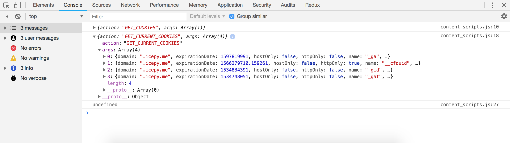
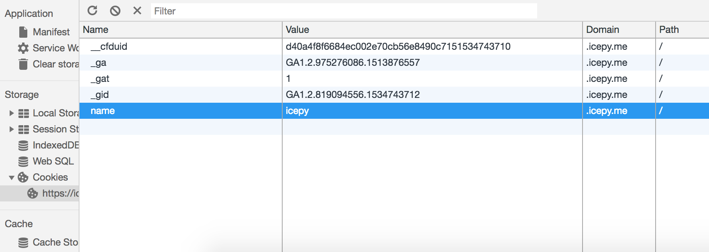

在网路的世界中，我们都知道 Cookie 被用于用户行为数据的追踪，因此 Chrome Extension API 也提供了操作 Cookie 相关的内容，这一组的 API 可以查询和修改 Cookie，或在 Cookie 被修改时得到一个通知。

## 配置

见 [manifest.json](https://github.com/welearnmore/chrome-extension-demos/blob/master/cookies/manifest.json)，只要在 `permissions` 添加 `cookies` 权限即可，这样你才能调用 Chrome Extension 提供的 cookies API。

## 开发

由于 cookies 的权限较高，在 `content_scripts` 等注入脚本中无法调用，因此对它做好的编写应该放置在 `background.js` 中，通过 Chrome Extension 的通信消息机制，让其他扩展文件去调用，如：

```javascript
var GET_COOKIES = "GET_COOKIES";
var GET_CURRENT_COOKIES = "GET_CURRENT_COOKIES";
var SET_COOKIES = "SET_COOKIES";

chrome.runtime.onMessage.addListener((request, sender, sendResponse) => {   
  var action = request.action;
  var args = request.args;
  switch (action) {
    case GET_COOKIES:
      chrome.cookies.getAllCookieStores(function(cookieStores){
        sendResponse({ action: GET_COOKIES, args: cookieStores });
      });
      return true;
    case GET_CURRENT_COOKIES:
      chrome.cookies.getAll({ url: "https://icepy.me"}, function(cookies){
        sendResponse({ action: GET_CURRENT_COOKIES, args: cookies });
      });
      return true;
    case SET_COOKIES:
      chrome.cookies.set({
        url: "https://icepy.me",
        name: "name",
        value: "icepy",
        domain: ".icepy.me"
      })
      break;
  }
})
```

在这个案例中，我使用了三个 `chrome.cookies.* API`，用于查询和设置，当我想查询一下我的博客 `https://icepy.me` 的 `cookie` ，在 `content_scripts` 中调用了一个通信来获取，如：

```javascript
var GET_COOKIES = "GET_COOKIES";
var GET_CURRENT_COOKIES = "GET_CURRENT_COOKIES";
var SET_COOKIES = "SET_COOKIES";

chrome.runtime.sendMessage({
  action: GET_COOKIES,
  args: ''
}, (response) => {   
  // 处理
  console.log(response);
});

chrome.runtime.sendMessage({
  action: GET_CURRENT_COOKIES,
  args: ''
}, (response) => {   
  // 处理
  console.log(response);
});

chrome.runtime.sendMessage({
  action: SET_COOKIES,
  args: ''
}, (response) => {   
  // 处理
  console.log(response);
});
```

效果图：





完整 demo 请查看 https://github.com/welearnmore/chrome-extension-demos/blob/master/cookies