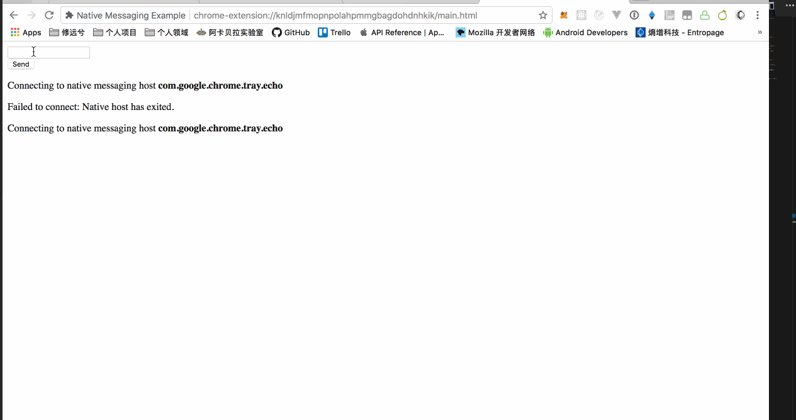

NativeMessage 是 Chrome 提供的一个 Desktop App 可以与 Chrome 插件进行跨进程通信的机制，请正确的配置 manifest file 权限 `nativeMessaging`，并由插件启动桌面通信进程即可。

演示项目：[NativeMessage](https://github.com/welearnmore/chrome-extension-demos/tree/master/nativemessage)

> Chrome starts each native messaging host in a separate process and communicates with it using standard input (stdin) and standard output (stdout). The same format is used to send messages in both directions: each message is serialized using JSON, UTF-8 encoded and is preceded with 32-bit message length in native byte order. The maximum size of a single message from the native messaging host is 1 MB, mainly to protect Chrome from misbehaving native applications. The maximum size of the message sent to the native messaging host is 4 GB.

我们使用 Swift 实现了两个函数 SendMessage 和 RecvMessage ，来处理通信。但它 NativeMessage 还是有一些细节问题需要注意：

- 发送的必须是 JSON 字符串
- UTF-8
- 32-bit 长度
- 最大消息体不能超过 1MB

## 配置

在进程启动之前，必须将一份启动的配置清单，写入 Chrome 安装目录下的 NativeMessagingHosts，清单格式如下：

```json
{
    "name": "com.google.chrome.tray.echo",
    "description": "Chrome Native Messaging API Example Host",
    "type": "stdio",
	  "path":"/Users/xiangwenwen/tray.app/Contents/MacOS/tray",
	  "allowed_origins": [
        "chrome-extension://knldjmfmopnpolahpmmgbagdohdnhkik/"
    ]
}
```

## Connect

跨应用的进程通信必须由 Chrome Extension 来启动，Google 给我们提供了 connect 用于此，如：

```javascript

function sendNativeMessage() {
  message = {"text": document.getElementById('input-text').value};
  port.postMessage(message);
  appendMessage("Sent message: <b>" + JSON.stringify(message) + "</b>");
}

function onNativeMessage(message) {
  appendMessage("Received message: <b>" + JSON.stringify(message) + "</b>");
}

function onDisconnected() {
  appendMessage("Failed to connect: " + chrome.runtime.lastError.message);
  port = null;
  updateUiState();
}

function connect() {
  var hostName = "com.google.chrome.tray.echo";
  appendMessage("Connecting to native messaging host <b>" + hostName + "</b>")
  port = chrome.runtime.connectNative(hostName);
  console.log(port)
  port.onMessage.addListener(onNativeMessage);
  port.onDisconnect.addListener(onDisconnected);
  updateUiState();
}
```

`hostName` 是由你在配置清单中的 `name` 字段，当你在 Chrome 浏览器中执行上述的代码，Chrome 会在 NativeMessagingHosts 目录中找到你要跨进程通信的 Path ，并由 Chrome 主动调起将 Pipe 重定向到 Chrome。

## SendMessage 函数

得到即将发送字符串的长度，先将长度发送过去，最后再发送字符串。由于print打印的数据是写入在缓冲区，并未真正的完成发送，因此最后需要调用fflush确认：

```swift
func sendMessage(msg: String){
  let data = "{\"echo\":\"\(msg)\"}"
  let len = data.characters.count
  print(Character(UnicodeScalar((UInt8)((len >> 0) & 0xff))), terminator:"")
  print(Character(UnicodeScalar((UInt8)((len >> 8) & 0xff))), terminator:"")
  print(Character(UnicodeScalar((UInt8)((len >> 16) & 0xff))), terminator:"")
  print(Character(UnicodeScalar((UInt8)((len >> 24) & 0xff))), terminator:"")
  print(data, terminator:"")
  fflush(__stdoutp)
}
```

## RecvMessage

读取消息时也需要先获取前4个bytes，得到真实消息的长度，然后substring(from:)，从而得到真实的消息体。

```swift
func recvMessage(){
  while true {
    let message_stdin = FileHandle.standardInput
    let message = String(data: message_stdin.availableData , encoding: .utf8)!
    let start = message.index(message.startIndex, offsetBy: 4)
    let text = message.substring(from: start)
    DispatchQueue.main.async {
      self.showMesg.stringValue = text
    }
  }
}
```

从官方文档上来看，这个API的细节处理暴露的并不是很多，调试还是挺困难的，有时候发生了错误，并不能明确快速的知道错误发生在哪里。整体的机制其实和socket编程挺类似的，前4个bytes存储的就是真实消息的长度，告诉对方，怎么获取到真实的消息。

