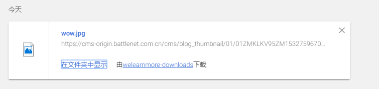
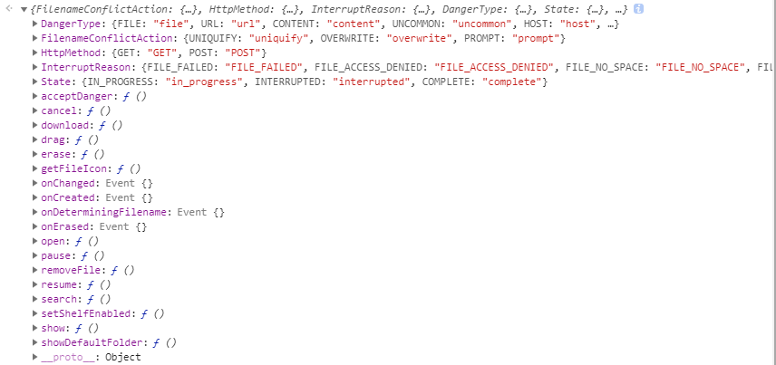

Chrome Extension 提供了一组 API 用于管理浏览器的下载功能，包括暂停，搜索，取消等，`downloads` API 从 Chrome 31 开始被支持，完整的文档信息可以访问官方Document: [https://developer.chrome.com/extensions/downloads](https://developer.chrome.com/extensions/downloads) 。

## 配置

在 `manifest.json` 文件中配置 `downloads` 的权限声明，如：

```javascript
{
  "name": "My extension",
  "permissions": [
    "downloads"
  ]
}   
```

## 开发

当我们想要创建一个下载时，我们可以使用 `downloads` 中的 `download`方法来实现，这个方法包含两个参数，参数一：关于下载的信息，比如 url 等，参数二：创建成功之后的一个回调。

> 关于下载URL，如果你的URL使用的HTTPS协议，那么该请求将包含当前为其主机设置的 Cookie。如果同时指定了 filename 和 saveAs，则将显示另存为对话框，并使用指定的文件名进行预填充。如果下载成功，回调函数可以获取到downloadId。如果下载失败，回调函数获取的downloadId则为undefined，并且chrome.runtime.lastError将包含一些错误信息，提供给开发者使用。

```javascript
chrome.downloads.download(object options, function callback)
```

其中 `options` 结构如下：

```javascript
{
  url: 下载文件的url,
  filename: 保存的文件名,
  conflictAction: 重名文件的处理方式,
  saveAs: 是否弹出另存为窗口,
  method: 请求方式（POST或GET），
  headers: 自定义header数组,
  body: POST的数据
}
```

关于 `conflictAction` 的取值，只能有三个：

- `uniquify` To avoid duplication, the filename is changed to include a counter before the filename extension.
- `overwrite` The existing file will be overwritten with the new file.
- `prompt` The user will be prompted with a file chooser dialog.

现在让我们看一个例子，从 `魔兽世界` 官网下载一张图片：

```javascript
var down = document.getElementById("down");
down.addEventListener("click", function(){
  var options = {
    url: "https://cms-origin.battlenet.com.cn/cms/blog_thumbnail/01/01ZMKLKV95ZM1532759670729.jpg",
    filename: "wow.jpg",
    conflictAction: "overwrite",
    method: "GET",
  };
  chrome.downloads.download(options, function(){
    
  });
})
```

如图：



在下载的过程中，我们还可以 `暂停`，`取消`等：

```javascript
// 暂停
chrome.downloads.pause(integer downloadId, function callback) 
```

```javascript
// 取消
chrome.downloads.cancel(integer downloadId, function callback) 
```

除了下载功能之外，我们还可以使用别的 `API`，如图：




So，完整 demo 请查看 https://github.com/welearnmore/chrome-extension-demos/blob/master/downloads


