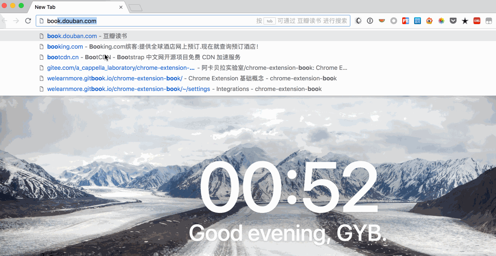

使用 [omnibox](https://developers.chrome.com/extensions/omnibox) API 可以定制你的搜索框:



如图，在这个 demo 里我们可以在搜索框中直接搜索想要的书籍，然后调取豆瓣的 API 接口，选择一本书，然后选择新建 tab 打开 [图灵社区](http://www.ituring.com.cn/)、[异步社区](https://www.epubit.com/)、[博文视点](http://www.broadview.com.cn/)。

## 配置

见 [manifest.json](https://github.com/welearnmore/chrome-extension-demos/blob/master/omnibox/manifest.json#L13-L19)，只要添加 `omnibox` 即可，`keyword` 则是你想要在搜索框中响应的关键字，本文 demo 使用 `book`。而 `background` 也是必不可少的，omnibox 的逻辑都在这里。

## 开发

逻辑都在 [background.js](https://github.com/welearnmore/chrome-extension-demos/blob/master/omnibox/background.js) 中，注意 API:

* [chrome.omnibox.onInputChanged](https://developers.chrome.com/extensions/omnibox#event-onInputChanged): 搜索框中输入内容的事件
* [chrome.omnibox.onInputEntered](https://developers.chrome.com/extensions/omnibox#event-onInputEntered): 选中内容的事件

可以在 `chrome.omnibox.onInputChanged` 中 **suggest** 方法中定义输出的内容，参数为数组：

```javascript
suggest([
  {
    content: text,
    description: 'one'
  },
  {
    content: text,
    description: 'two'
  }
])
```

还可以在 `chrome.omnibox.onInputEntered` 中定义选中后的行为，demo 中是打开新 tab 页面：

```javascript
chrome.omnibox.onInputEntered.addListener(function(text) {
  booksPrefix.forEach((bookUrl) => {
    const url = bookUrl + text
    openTab(url)
  })
})
```

> openTab 函数使用了 [tab](https://developer.chrome.com/extensions/tabs) API，这也是一个重要的 Chrome Extension API，`chrome.tabs.create` 可以新打开一个 tab。

## 其他

你可能还发现 `background.js` 中还有 `fetchSuggest` 方法，用来从豆瓣接口得到书籍的数据，这个接口会是一个 AJAX 接口。你对前端开发了解的话，就知道我们这是在跨域调取数据，Chrome Extension 是[允许跨域](https://developer.chrome.com/extensions/xhr)的，但是一定要在 `manifest.json` 中[声明](https://github.com/welearnmore/chrome-extension-demos/blob/master/omnibox/manifest.json#L20-L22):

```json
"permissions": [
  "https://book.douban.com/"
]
```

完整 demo 请查看 https://github.com/welearnmore/chrome-extension-demos/blob/master/omnibox