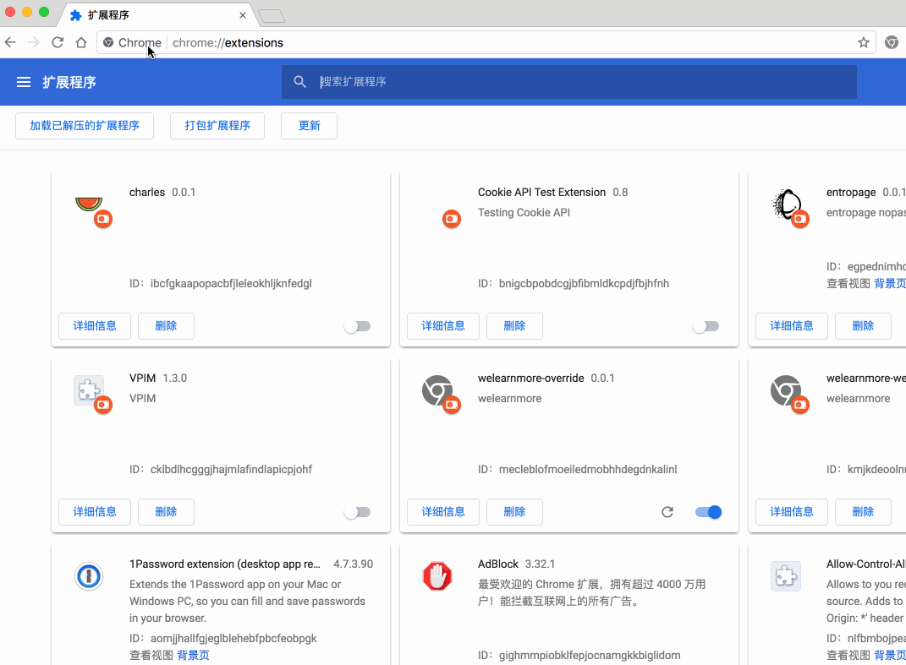
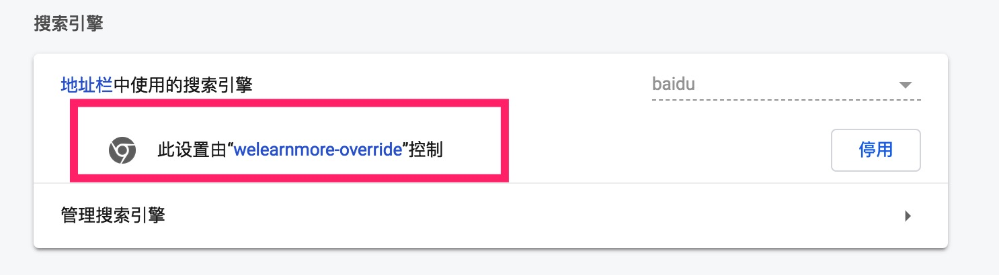

## chrome_settings_overrides

[chrome_settings_overrides](https://developer.chrome.com/extensions/settings_override) 可以让开发者定制 Chrome 设置:

* 主页
* 搜索引擎



这一部分很简单，都是在 `manifest.json` 配置:

```json
"chrome_settings_overrides": {
  "homepage": "https://welearnmore.gitbook.io/chrome-extension-book/",
  "search_provider": {
    "encoding": "UTF-8",
    "favicon_url": "https://www.baidu.com/favicon.ico",
    "is_default": true,
    "keyword": "baidu.com",
    "name": "baidu",
    "search_url": "https://baidu.com/?q={searchTerms}"
  }
}
```

然后用户就会在设置页面看到下面的信息：




看起来很酷对不对，用户装了你的插件你就可以改了用户的主页和搜索引擎，但是建议你不要这么做（如果你的插件并不是提供这个服务的话）。因为你改了用户默认设置，一旦被用户发现，很可能就被卸载掉。

------

## chrome_url_overrides

Chrome Extension 还提供 [chrome_url_overrides](https://developer.chrome.com/extensions/override)，可以让开发者定制页面:

* bookmarks - 收藏夹
* history - 历史记录
* newtab - 新 tab 页

现在以收藏夹为例，展示一个自定义收藏夹的例子:

```json
"chrome_url_overrides": {
  "bookmarks": "bookmarks.html"
},
"permissions": [
  "bookmarks"
]
```

具体代码可以在 [chrome-extension-demos](https://github.com/welearnmore/chrome-extension-demos/tree/master/override) 中找到。

至于 history 和 newtab，已经有很多成熟的插件在做了，介绍给大家:

* [History Master](https://chrome.google.com/webstore/detail/mkfgjjeggnmkbobjmelbjhdchcoadnin): 管理历史记录，很方便地按照时间归纳
* [Momentum](https://chrome.google.com/webstore/detail/laookkfknpbbblfpciffpaejjkokdgca): 每天更换一张 newtab 壁纸，让你每天都有不同的心情