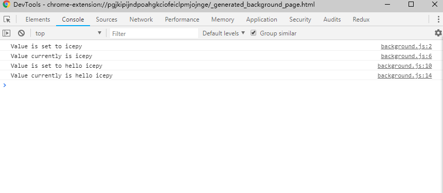

`storage` API 是一组经过了特别优化的存储相关的 API，它提供了和 `localStorage` 非常类似的能力，只是与它会有少许区别。这一组 API 不仅可以存储，还可以获取用户数据，追踪用户数据，甚至可以根据你的 Google 账户在云端进行同步。

让我们来看一看，它到底有哪些不同：

- 用户数据可以通过 Chrome 进行同步（`storage.sync`）
- 你的扩展程序的内容脚本可以直接访问用户数据，而不用写在 `background` 中
- 即使用户使用了隐身模式，用户的扩展程序的设置也可以被保留
- 它是异步的，并且可以批量的读写操作，因此比 `localStorage` 要快很多
- 用户数据可以存储为对象（`localStorage` 只能存储为字符串）
- 可以读取管理员为扩展程序配置的企业策略（使用 `storage.managed`）

## 配置

在 `manifest.json` 文件中配置 `storage` 权限声明，如：

```javascript
{
  "name": "My extension",
  "permissions": [
    "storage"
  ]
}
```

## 开发

如果我们想使用存储用户数据的API，那么我应该使用 `storage.sync` 或 `storage.local`，当我们使用 `storage.sync`时存储的数据将会自动的在用户启用同步功能并且已经登录 Chrome 浏览器的同时被同步。而 `storage.local` 正好与之相反，它是将数据存储在本地的硬盘上，并且有插件的沙盒隔离，这也意味着别的插件无法获取你存储的数据，因为沙盒的存在。使用它们都非常的简单，如：

```javascript
chrome.storage.local.set({key: "icepy"}, function() {
  console.log('Value is set to ' + "icepy");
});

chrome.storage.local.get(['key'], function(result) {
  console.log('Value currently is ' + result.key);
});
```

```javascript
chrome.storage.sync.set({key: "hello icepy"}, function() {
  console.log('Value is set to ' + "hello icepy");
});

chrome.storage.sync.get(['key'], function(result) {
  console.log('Value currently is ' + result.key);
});
```

如图：



与此同时它也提供了一个 `onChanged` 事件，用于当存储有任何更改时，我们可以通过这个事件来处理一些事情，如：

```javascript

chrome.storage.onChanged.addListener(function(changes, namespace) {
  for (key in changes) {
    var storageChange = changes[key];
    console.log('存储键“%s”（位于“%s”命名空间中）已更改。' +
                    '原来的值为“%s”，新的值为“%s”。',
                key,
                namespace,
                storageChange.oldValue,
                storageChange.newValue);
  }
});
```

如图：


不过，我们需要注意的是关于 `存储空间与调用频率`的问题，这一组API可存储的空间并不是无限大的，当你要存储的数据快将它存满时，得到的反馈可能是操作这些API的延迟反应。我们可以在 `StorageArea` 中查询一些配置信息，这些配置信息可以有助于我们了解，该如何去规划你的存储业务。

完整 demo 请查看 https://github.com/welearnmore/chrome-extension-demos/blob/master/storage