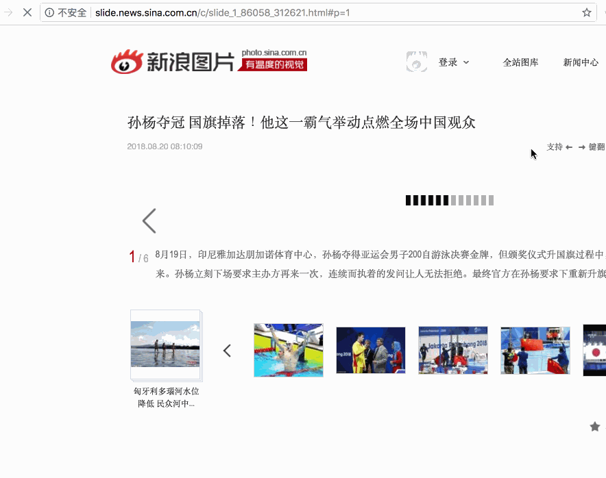

使用 [webRequest](https://developers.chrome.com/extensions/webRequest) API 可以让插件监控 Chrome 的网络请求，甚至重定向请求。



如图，我们可以替换掉原有图片。

## 配置

见 [manifest.json](https://github.com/welearnmore/chrome-extension-demos/blob/master/webrequest/manifest.json#L9-L16)

* webRequest: 开启 webRequest
* webRequestBlocking: 让 webRequest 可以 block 网络请求

> 需要注意的是，使用 webRequest 的时候，`background` 不能设置 `"persistent": false`，因为它需要[时刻监控](https://developer.chrome.com/extensions/background_pages#manifest)。
>
> 还有，webRequest 不能替换 https 资源 !

## 开发

```javascript
// background.js
chrome.webRequest.onBeforeRequest.addListener(
  function (details) {
    const url = details.url;

    if (url === 'http://n.sinaimg.cn/news/1_img/upload/7b577cec/576/w778h598/20180820/lSSg-hhxaafy9194151.jpg') {
      console.log(22)
      return {
        redirectUrl: 'https://github.com/welearnmore/chrome-extension-book/raw/master/doc/images/logo_google_developers.png'
      }
    }

    return {cancel: false}
  },
  {urls: ["<all_urls>"]},
  ["blocking"]
)
```

最后，打开[页面](http://slide.news.sina.com.cn/c/slide_1_86058_312621.html#p=1) 即可看见效果。