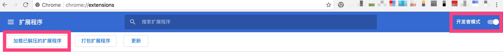
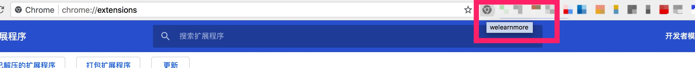
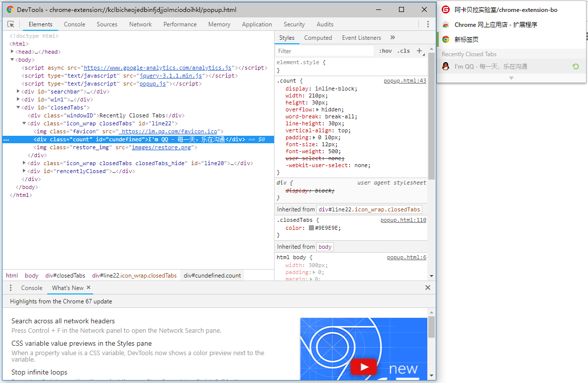
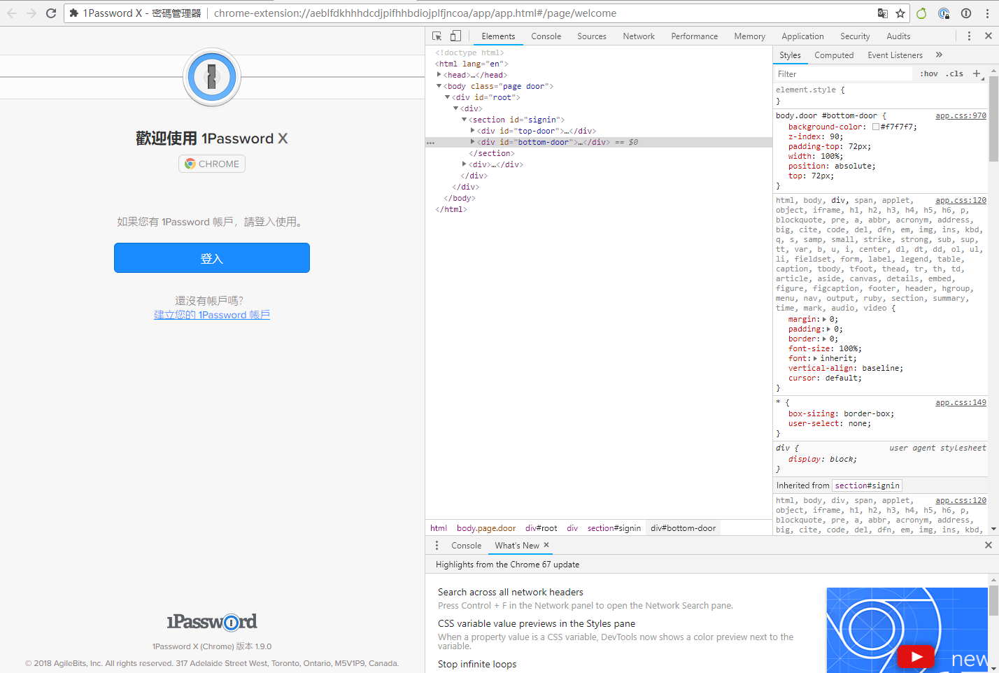
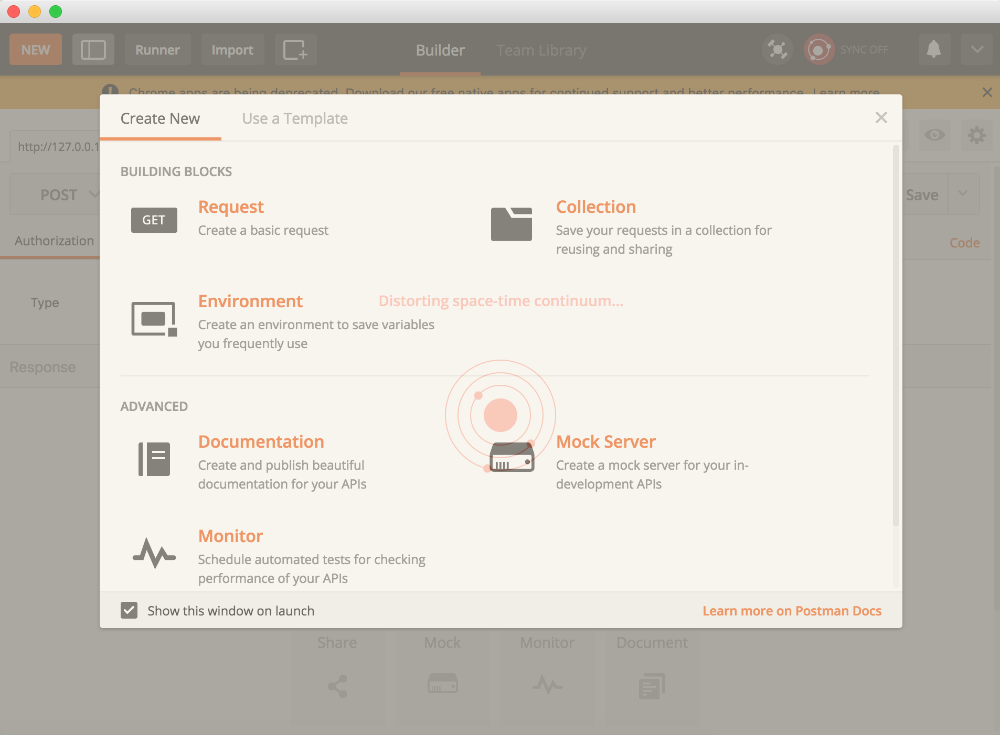

Chrome Extension 是 Chrome 浏览器的扩展，也就是大家所说的『插件』。Chrome 插件其实就是运用 Web 技术开发的能增强 Chrome 功能的软件。

> 如果您有用 Electron 开发桌面应用或者开发微信小程序的经验，就应该很容易理解 Chrome Extension 的开发原理。Electron 是运用 Web 技术加 Electron 提供给我们的 API 开发，那么就是 Chrome Extension 的开发应用的就是 Web 技术加上 Chrome 的 API 即可。

具体点地说，[Chrome Extension API][Chrome Extension API] 中已经列出了我们所有能用到的 API，可以做到但不限于：

* 网络请求控制
* 自定义右键
* 网页中插入 CSS 、JavaScript 文件
* 管理书签
* 管理 cookie
* omnibox 管理
* ...

> 细心的你，可能看到还有 [Chrome App API][Chrome App API]，关于 **Chrome App** 我们后面会说到。

## 你的第一款插件

现在，让我们开始你的第一款插件开发。

1. 下载[init][init]这个文件夹，可以看见，这个文件夹及其简单，只有 `manifest.json` 文件和 `img` 文件夹，甚至 `img` 都不是必须的，只要一个 `manifest.json` 就可以了。

2. 在地址栏输入 [chrome://extensions](chrome://extensions/) 或者 `菜单->更多工具->扩展程序` 进入插件管理页面，然后打开 **开发者模式**

3. 点击 **加载已解压的扩展程序**，选择刚下载的 [init 文件夹][init]

  

4. 完成了！你现在可以看到你的第一款 Chrome Extension 了！

  


好了，请保存好 [init][init] 文件夹，这是我们之后每一个 demo 的基础，你会看到我们每一个复杂的实例都是从这个简单的文件夹开始的

## manifest.json 文件

一个Chrome Extension只允许包含一个manifest.json文件（清单文件），它提供了有关Extension方方面面的信息，例如你的Chrome Extension将具备什么样的能力（调用chrome api所需要的权限设置），你的Chrome Extension popup将是一个什么样的图标icon等等。

如下所示是一个典型的清单文件：

```JavaScript
{
  "name": "我的扩展程序",
  "version": "2.1",
  "description": "从 Google 获取信息。",
  "icons": { "128": "icon_128.png" },
  "background": {
    "persistent": false,
    "scripts": ["bg.js"]
  },
  "permissions": ["http://*.google.com/", "https://*.google.com/"],
  "browser_action": {
    "default_title": "",
    "default_icon": "icon_19.png",
    "default_popup": "popup.html"
  }
}
```

每一项所属的意义都是明确的，例如`icons`，如果你想配置popup的icon，那么key-value就是`"16":"img/icon.png"`，如果你想配置background面板的icon，那么key-value就是`"48:"img/icon.png""`。manifest.json文件几乎贯彻了你的Chrome Extension应用程序。

更多清单的信息，可查阅 [Manifest File Format][Manifest File Format]

## 如何调试你的 Chrome Extension

调试 Chrome Extension 就如同调试一款网页应用程序一般简单，借助 Chrome Dev Tool 提供的能力，我们能很方便的进行调试。

Popup 的调试面板，右键点击 `查看`，如图：



Background 的调试面板，需要在地址栏中输入 `chrome://extensions/` ，然后选择当前要调试扩展的background。

Options 的调试面板可以在 Popup 中右键选择 `Option` 进入页面后，按正常的网页调试来开启，如图：



## Chrome Web App 与 Extension 的区别

在 Chrome 的世界里还有另外一种与 Extension 稍有区别的类型，那就是 `Chrome Web App`。它通常具备独立的用户界面，并且具备典型丰富的用户交互功能。

具体点来说：

* API调用不一样
* 打包，安装的方式不一样
* 独立的应用程序

一个非常典型的 Chrome Web App，如：`Postman`。



----

[Chrome Extension API]: https://developers.chrome.com/extensions/api_index
[Chrome App API]: https://developers.chrome.com/apps/api_index
[init]: https://github.com/welearnmore/chrome-extension-demos/tree/master/init
[Manifest File Format]: https://developer.chrome.com/extensions/manifest