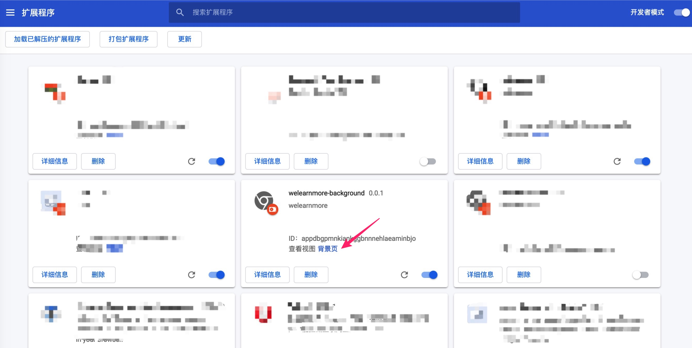
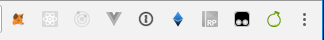
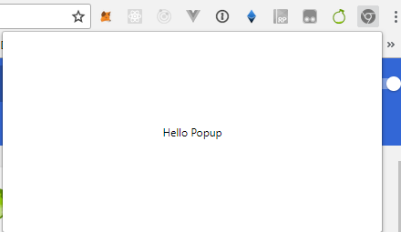

## 常驻后台 background

可以理解 background 是一个常驻 Chrome 后台的页面，只要浏览器打开它就存在，Chrome 关闭它才关闭，一般把需要一直运行的、全局代码都放在 background 里。

现在，加载 [background 文件夹][background folder]，开始学习吧。

### 配置

要使用 background 非常简单，只要在 manifest.json 里添加 [配置][background config] 即可。

体验一下，在 `backgorund.js` 中添加如下代码，试试是不是在 10 秒后 alert 出 `Hello, world!`

```javascript
// background.js
let timeout = 10000;
window.setTimeout(function() {
  alert('Hello, world!');
}, timeout);
```

### 调试

加载完成后，可以看到 **背景页**，点击打开，就看到我们熟悉的调控台了。




### 权限

background 权限很高，几乎可以使用[这里][Chrome Extension API]所有的 API。


## 侧边栏按钮 popup

看上去 Popup 就是一个普通的HTML文件，它可以包含任何内容，比如：`HTML`，`CSS`，`JavaScript`，与普通网页唯一的区别是，它显示在浏览器的右上角，如图：



你可以使用 Popup Actions 将图标放置在地址栏中，并且定义需要处理的页面事件，显而易见，在这里的处理，可以在 manifest.json 文件中配置完成。

现在，加载 [popup 文件夹][popup folder]，来开始学习吧。

### 配置

如果要开启 Popup 需在 manifest.json 文件中 [配置入口文件][popup config] 即可：

```JavaScript
{
  "name": "我的popup扩展程序",
  "version": "2.0",
  "browser_action": {
    "default_title": "popup action page",
    "default_icon": "img/logo.png",
    "default_popup": "popup.html"
  }
}
```

### 运行结果



### 权限

与 background 不同的是，它是一个可见的网页，因此可以理解为普通浏览器中的安全策略以及限制在这个运行环境中同样存在，并且可调用的 Chrome API 有与 background 不同，它是受限的。


## 注入页面脚本 Content Scripts

`Content Scripts` 是运行在页面中的一段脚本（JavaScript文件），通过 Web DOM 接口，写在 Content Scripts 中的脚本可以读取Web页面中的任何元素内容，但它和真正的 `inject` 还有稍许区别，试想一下，如果我们在一个 React 应用程序中，想获取到 React 对象，以及任何原页面本身的脚本上下文，`Content Scripts` 并没有提供这样的能力，而是需要额外再注入一段脚本，这个脚本是由 `script` 标签创建的 JavaScript。

那么 `Content Scripts` 都提供了哪些能力：

- 少部分的 Chrome *API 可以使用
- 可以获取 DOM 元素

限制条件如下：

- 大部分的 Chrome *API 无法使用
- 不能访问 Chrom Extension 页面中定义的变量和函数
- 不能访问 Web 页面 或者其他 Content Scripts 中定义的变量和函数

一般而言，我们常常使用 `Content Scripts` 做一些比如处理 DOM 的事情，很可惜如果你想真正的访问 Web 页面中定义的变量和函数，还是可以使用另外的一种方式来解决这个问题。咋一看，Content Scripts 不能访问 Chrome Extension 页面中定义的变量和函数，但是我们可以使用 Chrome Extension 通信消息机制来处理这个问题，间接性的来进行交互。

目前来说在 Chrome Extension 中使用 Content Scripts 有两种方式可供选择：

- 在 manifest.json 文件中声明 Content Scripts
- 在某个状态条件的触发下动态的注入

### 声明 Content Scripts

声明的 Content Scripts 非常的简单，我们只需要在 [manifest.json][content scripts config] 文件中声明即可，如：

```javascript
{
  "version": "0.0.1",
  "name": "welearnmore-content_scripts",
  "manifest_version": 2,
  "description": "welearnmore",
  "content_scripts": [
    {
      "matches": ["https://icepy.me/*"],
      "js": ["content_scripts.js"]
    }
  ],
  "content_security_policy": "script-src 'self' 'unsafe-eval'; object-src 'self';"
}

```

我们可以在 `content_scripts.js` 文件中随便写一个log，如：`console.log('icepy')`，然后运行一下，在控制台中，将得到如下的一行输出：如图：


体验项目 [查看][content scripts folder]


## 后台页面 options page

-----

[content scripts folder]: https://github.com/welearnmore/chrome-extension-demos/tree/master/content_scripts
[content scripts config]:https://github.com/welearnmore/chrome-extension-demos/tree/master/content_scripts/manifest.json
[popup folder]: https://github.com/welearnmore/chrome-extension-demos/tree/master/popup
[popup config]:https://github.com/welearnmore/chrome-extension-demos/tree/master/popup/manifest.json
[Chrome Extension API]: https://developers.chrome.com/extensions/api_index
[background folder]: https://github.com/welearnmore/chrome-extension-demos/tree/master/background
[background config]: https://github.com/welearnmore/chrome-extension-demos/blob/master/background/manifest.json#L9-L11