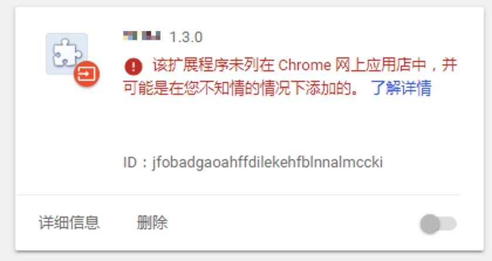
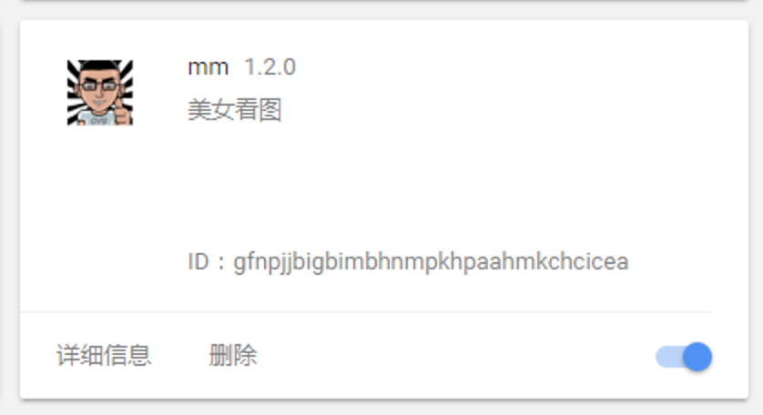
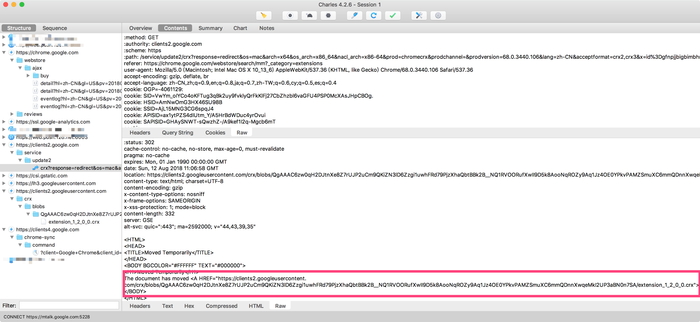

## 背景

最开始，用户安装 Chrome Extension 由三种办法：

* 官方: 在 https://chrome.google.com/webstore 下载、安装
* inline install: https://developer.chrome.com/webstore/inline_installation ，支持开发者在自己的网站上使用 Chrome API 一键安装 
* 用户自己在 chrome://extension crx 文件安装

### 用户自己安装 crx 文件

Windows Chrome 用户自己在 chrome://extension 安装 crx 的方法在 13 年就已经被[禁止](https://blog.chromium.org/2013/11/protecting-windows-users-from-malicious.html)。

而 Mac Chrome 用户安装 crx 的方法在 15 年也被[禁止](https://blog.chromium.org/2015/05/continuing-to-protect-chrome-users-from.html)。但是我用 Mac 安装都没有遇见过这个问题，现在还不确定是什么原因。

> 详见 https://developer.chrome.com/extensions/external_extensions#prereqs

### inline install

在上面两则 Windows Chrome 禁止安装 crx、Mac Chrome 禁止安装 crx 的公告中，都说可以使用 inline install 来让用户不用在 Chrome store 中安装，但是 inline install 方法在今年（2018年）6月也被[禁止](https://blog.chromium.org/2018/06/improving-extension-transparency-for.html)了。

现在，只能在 Chrome Store 上安装应用了。

## 解决办法

看起来只能在 Chrome Store 安装 Extension 了，但是 GFW 的存在会让我们流失很多用户，所以要让用户能够不在 Chrome Store 下载 crx 也能使用 Extension。尝试了一种看起来很蠢的办法：先把 Extension 在 Chrome Store 上发布，发布成功后把 crx 拖进 Chrome 安装，竟然就成功了！

下面是 Windows Chrome 直接安装 crx 文件的图，左图没有发布在 Chrome Store 上，右图已经发布到 Chrome Store 上。

 

知道了规避的方法，还需要知道 crx 下载地址。也很简单，在 Chrome Store 下载的时候，使用 Charles 就可以看到下载地址，这样我们每次发版成功后下载这个 crx，就可以让 Windows Chrome 用户不翻墙也能安装我们的 Extension 了。

